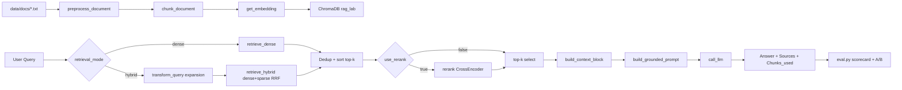

# Architecture — RAG Pipeline (Day 08 Lab)

## 1. Tổng quan kiến trúc

```
[data/docs/*.txt]
    ↓
[index.py: preprocess_document → chunk_document → get_embedding → build_index]
    ↓
[ChromaDB: collection "rag_lab" (cosine)]
    ↓
[rag_answer.py: retrieve (dense/hybrid) → optional rerank → grounded prompt → call_llm]
    ↓
[Grounded answer + citation + sources]
    ↓
[eval.py: scorecard baseline/variant + A/B comparison]
```

**Mô tả ngắn gọn:**
Hệ thống là pipeline RAG cho trợ lý nội bộ CS + IT Helpdesk, trả lời câu hỏi chính sách/SLA bằng ngữ cảnh retrieve từ kho tài liệu nội bộ. Luồng chính gồm indexing tài liệu vào ChromaDB, retrieval (dense hoặc hybrid), tạo grounded prompt, rồi sinh câu trả lời có citation. `eval.py` dùng bộ test 10 câu để chấm điểm và so sánh baseline/variant.

---

## 2. Indexing Pipeline (Sprint 1)

### Tài liệu được index
| File | Nguồn (metadata `source`) | Department | Số chunk |
|------|----------------------------|-----------|---------|
| `policy_refund_v4.txt` | `policy/refund-v4.pdf` | CS | 6 |
| `sla_p1_2026.txt` | `support/sla-p1-2026.pdf` | IT | 5 |
| `access_control_sop.txt` | `it/access-control-sop.md` | IT Security | 8 |
| `it_helpdesk_faq.txt` | `support/helpdesk-faq.md` | IT | 6 |
| `hr_leave_policy.txt` | `hr/leave-policy-2026.pdf` | HR | 5 |

**Tổng số chunk hiện tại:** **30**

### Quyết định chunking
| Tham số | Giá trị | Lý do |
|---------|---------|-------|
| Chunk size | 320 tokens | `index._estimate_chunk_settings()` tính từ độ dài section/paragraph thực tế trong `data/docs` để ưu tiên precision cho fact lookup |
| Overlap | 60 tokens | Giữ ngữ cảnh liên đoạn (~15-20%), giảm mất ý khi cắt chunk |
| Chunking strategy | Heading-based trước, sau đó paragraph/sentence fallback | `chunk_document()` split theo `=== ... ===`, `_split_by_size()` ghép paragraph, `_split_large_paragraph()` fallback khi đoạn quá dài |
| Metadata fields | `source`, `section`, `department`, `effective_date`, `access`, `chunk_index`, `chunk_chars` | Phục vụ trace nguồn, filtering, phân tích coverage, và citation |

### Embedding và lưu trữ
- **Embedding (ưu tiên):** OpenAI `text-embedding-3-small` (khi có `OPENAI_API_KEY`)
- **Embedding fallback local:** `SentenceTransformer("paraphrase-multilingual-MiniLM-L12-v2")`
- **Vector store:** ChromaDB `PersistentClient(path=chroma_db)`
- **Collection:** `rag_lab`
- **Similarity metric:** Cosine (`metadata={"hnsw:space": "cosine"}`)

---

## 3. Retrieval Pipeline (Sprint 2 + 3)

### Baseline (Sprint 2)
| Tham số | Giá trị |
|---------|---------|
| Strategy | Dense retrieval (`retrieve_dense`) |
| Top-k search | 10 |
| Top-k select | 3 |
| Rerank | Không bật (`use_rerank=False`) |
| Query transform | Không |

### Variant (Sprint 3)
| Tham số | Giá trị | Thay đổi so với baseline |
|---------|---------|------------------------|
| Strategy | Hybrid retrieval (`retrieve_hybrid`) | Đổi retrieval mode từ dense sang hybrid |
| Top-k search | 10 | Giữ nguyên |
| Top-k select | 3 | Giữ nguyên |
| Rerank | Không bật (`use_rerank=False`) | Giữ nguyên |
| Query transform | Expansion alias cho hybrid (`transform_query`) | Tăng recall cho alias/tên cũ (vd. Approval Matrix) |

**Lý do chọn variant này:**
Corpus chứa cả ngôn ngữ tự nhiên (policy/SLA) và nhiều keyword đặc thù (P1, approval matrix, lỗi mã). Hybrid kết hợp dense + lexical/BM25 giúp giữ semantic match và bổ sung khả năng bắt exact term/alias. Triển khai theo RRF với trọng số mặc định `dense_weight=0.6`, `sparse_weight=0.4`.

**Kết quả evaluation hiện có (`results/`):**
- Baseline (`scorecard_baseline.md`): Faithfulness **4.60**, Relevance **4.30**, Context Recall **5.00**, Completeness **3.10**
- Variant (`scorecard_variant.md`): Faithfulness **3.80**, Relevance **4.30**, Context Recall **5.00**, Completeness **3.30**
- Nhận xét nhanh: hybrid cải thiện một phần completeness nhưng chưa ổn định faithfulness ở vài câu khó (q03, q10).

---

## 4. Generation (Sprint 2)

### Grounded Prompt Template
```text
Answer only from the retrieved context below.
If the context is insufficient to answer the question, say you do not know and do not make up information.
Cite the source field (in brackets like [1]) when possible.
Keep your answer short, clear, and factual.
Respond in the same language as the question.

Question: {query}

Context:
[1] {source} | {section} | effective_date={effective_date} | score={score}
{chunk_text}

[2] ...

Answer:
```

### LLM Configuration
| Tham số | Giá trị |
|---------|---------|
| Model | `LLM_MODEL` từ env, mặc định `gpt-4o-mini` |
| Provider ưu tiên | OpenAI (`OPENAI_API_KEY`) |
| Provider fallback | Google Gemini (`GOOGLE_API_KEY`, model `gemini-1.5-flash`) |
| Temperature | 0 |
| Max tokens | 512 (`LLM_MAX_TOKENS`) |

### Guardrail và fallback
- Nếu context không đủ (`_is_context_sufficient=False`) thì trả lời abstain: *"Không đủ dữ liệu..."*
- Nếu không có API key/provider lỗi: dùng `_fallback_generate_answer()` trích câu liên quan từ chunk thay vì hallucinate.

---

## 5. Failure Mode Checklist

> Debug theo thứ tự: index → retrieval → generation → evaluation

| Failure Mode | Triệu chứng | Cách kiểm tra |
|-------------|-------------|---------------|
| Index lỗi/chưa build | Retrieve trả ít hoặc rỗng, fallback lexical nhiều | Chạy lại `build_index()` và `list_chunks()` trong `index.py` |
| Metadata coverage kém | Source/department/effective_date thiếu hoặc sai | `inspect_metadata_coverage()` trong `index.py` |
| Chunking chưa tốt | Trả lời thiếu ý do chunk cắt đoạn | Soát preview `list_chunks()` và tune chunking helper |
| Retrieval lỗi | Không lấy được expected source trong test set | `score_context_recall()` và scorecard trong `eval.py` |
| Grounding lỗi | Answer đúng chủ đề nhưng thiếu chứng cứ/citation | `score_faithfulness()` + kiểm tra `chunks_used` trong kết quả `rag_answer()` |
| Prompt/context quality thấp | Answer ngắn quá, thiếu điều kiện/ngoại lệ | Kiểm tra `build_context_block()` và `build_grounded_prompt()` |

---

## 6. Diagram


